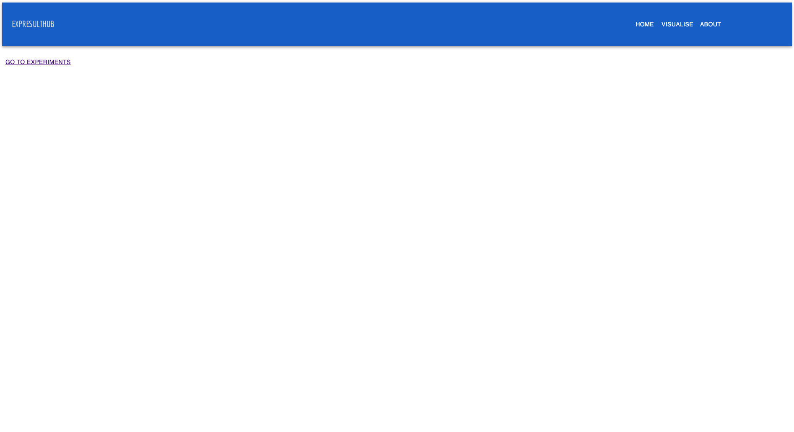
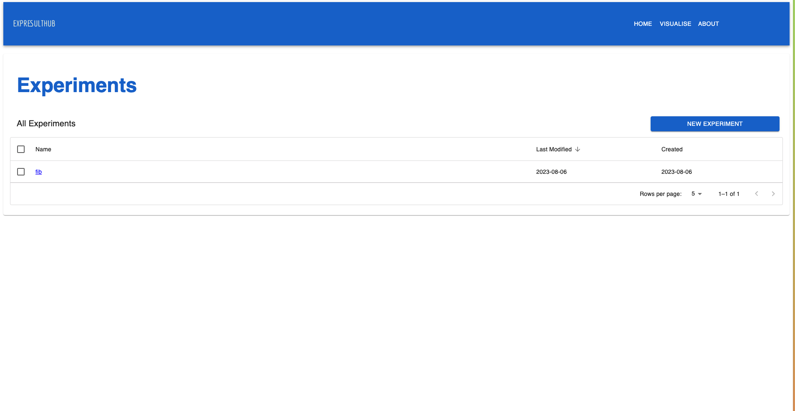
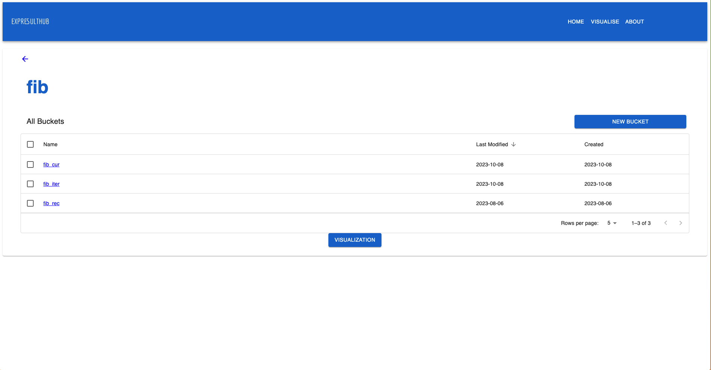
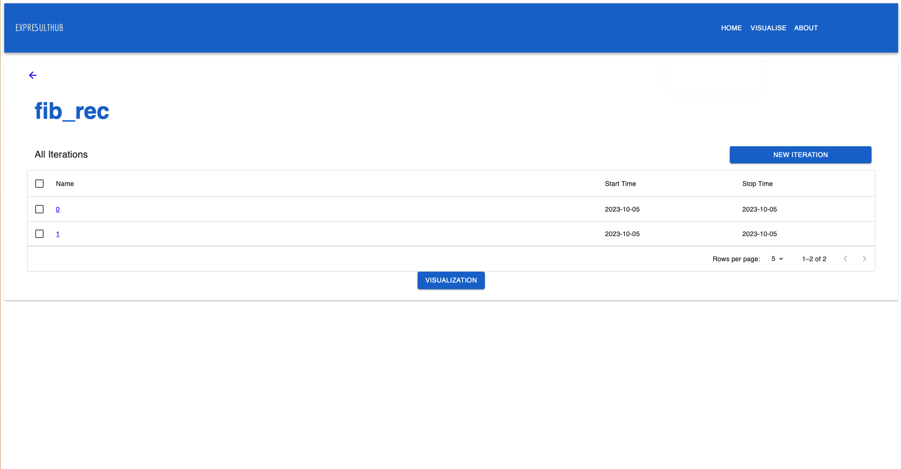
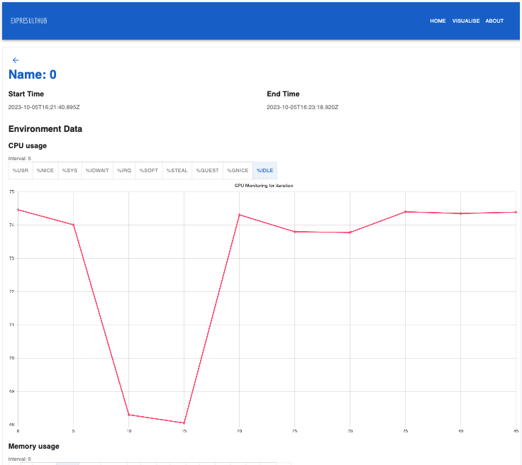
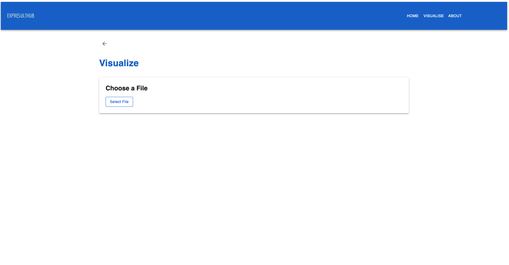

# ExpresHult Repository

This repository is an integral part of the "Public Artifact and Data Visualization" project. It serves as a user-friendly Graphical User Interface (GUI) designed to visualize experiments recorded through the command-line interface. The application is built using Next.js and relies on a MongoDB cluster as its primary database. It leverages Material UI and Chart.js to implement an intuitive and visually appealing user interface. The purpose of this app is to act as a comprehensive dashboard for all user-recorded experiments, allowing for in-depth analysis of metrics.

## Table of Contents

- [Home](#home)
- [Experiment Dashboard](#experiment-dashboard)
- [Experiment Visualisation Comparison](#experiment-visualisation-comparison)
- [Experiment Details](#experiment-details)
  - [Bucket Details](#bucket-details)
  - [Iteration Details](#iteration-details)
- [How to Set Up the Application](#setting-up)
- [Customizing Monitored Commands](#customizing-monitored-commands)
  - [Adding Custom Monitor Commands](#adding-custom-monitor-commands)

## Home

The home page (`/home`) serves as the entry point to the website and provides navigation links to different sections of the application.


## Experiment Dashboard

The experiment dashboard (`/experiment`) is the central hub for users. It offers a comprehensive overview of all their experiments, along with links to individual experiment details.


## Experiment Visualisation Comparison

The visualisation comparison feature (`/experiments/visualisation`) is a powerful tool that enables users to compare different experiments based on various parameters. Users can visualize and compare experiment data using a variety of graphs for each recorded metric. Additionally, the app allows users to export the compared data in JSON format for reference on other devices.

## Experiment Details

The app provides a detailed structure for each experiment, with the following substructures:

### Bucket Details

`/experiment/[experiment name]` displays a list of all the buckets within the experiment. Users can also access a similar visualisation feature as the experiment dashboard.


### Iteration Details

`/experiment/[experiment name]/[bucket name]/` presents a list of all the iterations specific to a particular experiment's bucket. Like other sections, it offers visualisation features for a more granular view of the data.


### Iteration Dashboard

`/experiment/[experiment name]/[bucket name]/[Iteration name]/` offers a comprehensive dashboard for individual iterations, displaying all associated metrics and visual representations, including recorded time and intervals.


## Visualize Experiments

The `/visualise` section allows users to visualize any experiment, even those not recorded personally. Users can import JSON files containing data for a specific iteration and utilize the same powerful visualization features for comparison and analysis.


# Setting Up

Follow these steps to set up and run this application on your machine:

## Getting Started

1. **Fork the Repository**

   Click the "Fork" button at the top right corner of this repository to create your own copy.

2. **Clone the Forked Repository**

   Use the `git clone` command to clone the repository to your local machine.

3. **Navigate to the Project Directory**

   Change your working directory to the project folder.

## Installation

1. **Install Dependencies**

   **Method 1:** Run `npm install` to install the project dependencies.

   **Method 2:** Run `docker build -t expresult -f Dockerfile .`

## Configuration

1. **Configure MongoDB**

   - Create a MongoDB database if you don't have one already.
   - Copy the connection URL for your MongoDB database.
   - Create a `.env.local` file in the root of your project and add the MongoDB connection URL as follows:

     ```env
     MONGODB_URI=your-mongodb-connection-url
     ```

     Replace `your-mongodb-connection-url` with the actual URL of your MongoDB database.

## Running the Application

1. **Start the Development Server**

   **Method 1:** Run `npm run dev` to start the Next.js development server. Your application will be accessible at `http://localhost:3000` by default.

   **Method 2:** Run `docker run expresult`.

2. **Access Your Local Application**

   Open your web browser and go to `http://localhost:3000` to access your locally running Next.js application.

# Starting monitor

## Installation

1. Clone the repository `git clone https://github.com/PublicExperimentDatabase/ExpresultHubCLI.git`.

2. Navigate to the project directory `cd ExpresultHubCLI`.

3. Install dependencies `npm install`.

4. Create a symbolic link for the CLI tool `npm link`.

## Usage

Once you have completed the installation steps, you can use the CLI tool by running the following command:

- `publicexperimentcli add-experiment <experiment-name> [description]`: Adds a new experiment with the specified name and optional description.

- `publicexperimentcli add-bucket <experiment-name> <bucket-name> [description]`: Adds a new bucket to an existing experiment. The bucket is associated with the specified experiment and can have an optional description.

- `publicexperimentcli add-iteration <experiment-name> <bucket-name> <iteration-number>`: Adds a new iteration to a specific bucket within an experiment. The iteration is identified by its number and is associated with the specified experiment and bucket.

- `publicexperimentcli start-monitor <experiment-name> <bucket-name> <iteration-number> <interval>`: Starts monitoring the specified experiment, bucket, and iteration. The monitoring interval is specified in seconds, and you can optionally specify specific metrics to monitor.

- `publicexperimentcli stop-monitor`: Stops the monitoring process for the current experiment, bucket, and iteration.

## Setting Up and Running Your Experiment

To set up and run your experiment using the ExpresultHubCLI tool, follow these steps:

1. Add a new experiment:

   ```bash
   publicexperimentcli add-experiment <experiment-name> [description]
   ```

2. Define your buckets and iterations using the following script as an example:
   ```bash
   # for bucket in <bucket1> <bucket2> <bucket3> ...
   for bucket in <bucket1> <bucket2> <bucket3>
   do
     # add-bucket <experiment-name> <bucket-name> [description]
     publicexperimentcli add-bucket <experiment-name> $bucket [description]
     for it in $(seq 0 <num-iterations>)
     do
       # add-iteration <experiment-name> <bucket-name> <iteration-number>
       publicexperimentcli add-iteration <experiment-name> $bucket $it
       # start-monitor <experiment-name> <bucket-name> <iteration-number> <interval> [metrics ...]
       publicexperimentcli start-monitor <experiment-name> $bucket $it <monitor-interval> [metrics ...]
       # run your custom script or command here
       <your-custom-script-or-command>
       # stop-monitor
       publicexperimentcli stop-monitor
     done
   done
   ```

Replace `<bucket1>`, `<bucket2>`, etc. with the names of your desired buckets. Customize the script by specifying the number of iterations `<num-iterations>`, the monitoring interval `<monitor-interval>`, and your own custom script or command `<your-custom-script-or-command>`.

3. Save the script as a shell file, for example, `my_experiment.sh`.

4. Grant execute permissions to the script:

```bash
chmod +x my_experiment.sh
```

5. Run your experiment:

```bash
./my_experiment.sh
```

This will execute your custom script, which includes the commands provided in the example. The script will create an experiment, add buckets and iterations, start monitoring, run your custom logic, and stop monitoring for each iteration.

For a complete example and code implementation, you can refer to the [Example Repository](https://github.com/PublicExperimentDatabase/test-experiment/blob/master/run.sh) that demonstrates the setup and execution of the experiment using the ExpresultHubCLI tool.

## Customizing Monitored Commands

To enhance the monitoring capabilities of the project, you have the flexibility to create and integrate your custom monitoring commands. We have provided predefined monitor commands for iostat, mpstat, and vmstat, which serve as examples. You can refer to these files located in /src/helper/monitorCommands to create your custom monitor commands and integrate them into /src/helper/monitor.ts.

### Adding Custom Monitor Commands

To add your own custom monitor commands, follow these steps:

1.  Create Your Environment Data Configuration:
    Start by defining the new environment data configuration. This configuration includes the name of your command and the interval at which it will be monitored. You can add it as an object to the newEnvironmentData array in /src/helper/monitor.ts. Here's an example:

```typescript
const newEnvironmentData = [
  {
    command: "Your Custom Command",
    interval: interval,
  },
  // Add more commands here as needed
];
```

2. Implement Your Monitoring Function: Create a new function that will handle the monitoring of your custom command. For instance:

```typescript
yourCustomCommandMonitoring(interval, existingIteration, commandIndex);
```

3. Define Command-Specific Headers: Specify the headers that your custom command will produce in each iteration. This allows you to process the data correctly. For example:

```typescript
const yourCustomCommandHeaders: string[] = [
  "Header1",
  "Header2",
  // Add more headers here as needed
];
```

4. Adjust Line Count Parameters: Set the appropriate values for prevLineCount and iterLineCount. prevLineCount indicates how many initial lines should be skipped in the command's output, and iterLineCount specifies the number of lines to consider in each interval.

```typescript
Copy code
const prevLineCount = 0; // Number of initial lines to skip
const iterLineCount = 2; // Number of lines to consider in each interval
```

By following these steps, you can customize and integrate your own monitoring commands seamlessly into the project. Be sure to adapt the configuration and logic to your specific command's output format and requirements.

Feel free to repeat these steps for any additional custom monitoring commands you'd like to include in your project.
